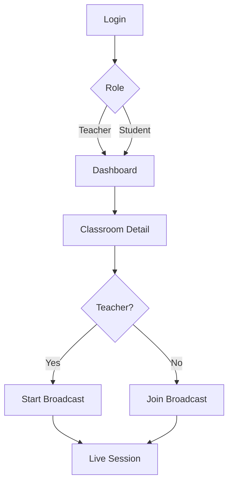
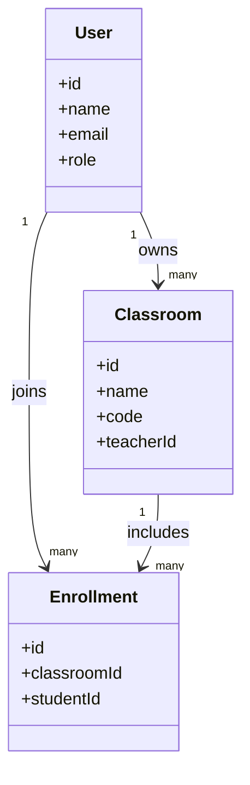
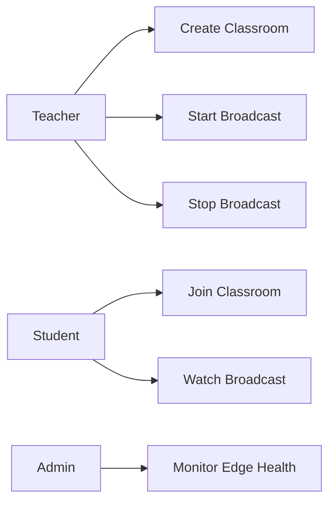
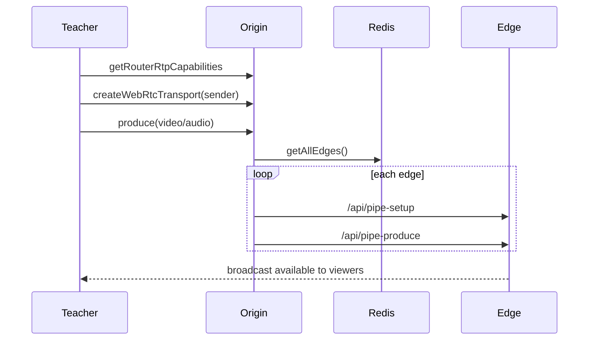
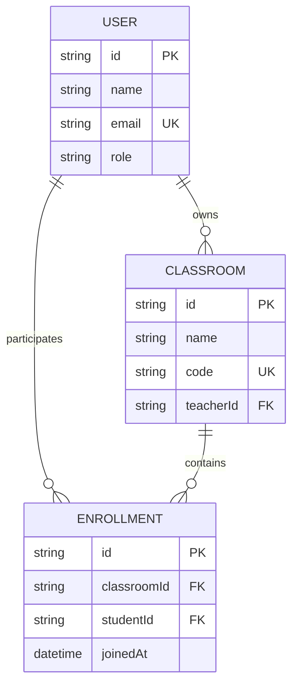
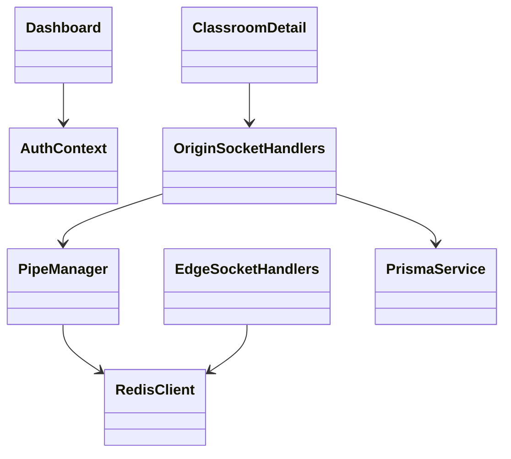
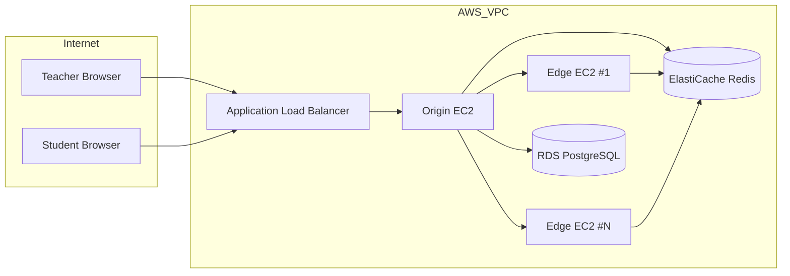
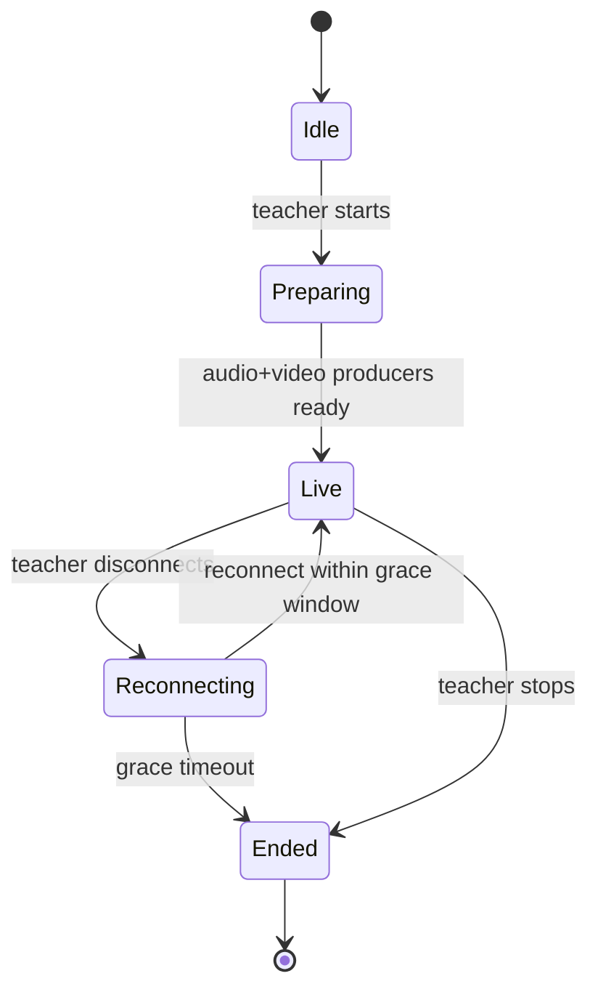

# I. Cover Page

**Project Title:** BroadClass - Scalable One-to-Many Live Classroom Broadcast Platform  
**Department:** Information Technology  
**Institute:** DDU (Faculty of Technology, Dept. of IT)  
**Academic Year:** 2025-2026  
**Report Type:** Final Year Project Report

> Note: This draft intentionally excludes personal identity details, signatures, and institute-issued certificate text.

---

# II. First Page

**Project:** BroadClass  
**Submitted In Partial Fulfillment of Degree Requirements**  
**Department of Information Technology**

Prepared by project group under the guidance of faculty mentor.

---

# III. Candidate's Declaration

**Intentionally excluded in this draft.**  
To be inserted by candidate with name, enrollment number, date, and signature.

---

# IV. College Certificate

**Intentionally excluded in this draft.**  
To be inserted on official letterhead signed by guide/HOD/principal as per institute rules.

---

# V. Acknowledgement

**Intentionally excluded in this draft** as requested.

---

# VI. Table of Contents

To be auto-generated in Word from heading styles.

1. Abstract  
2. List of Figures  
3. List of Tables  
4. Abbreviations  
5. Notations  
6. Chapter 1 - Introduction  
7. Chapter 2 - Project Management  
8. Chapter 3 - System Requirements Study  
9. Chapter 4 - System Analysis  
10. Chapter 5 - System Design  
11. Chapter 6 - Implementation Planning  
12. Chapter 7 - Testing  
13. Chapter 8 - User Manual  
14. Chapter 9 - Limitation and Future Enhancement  
15. Chapter 10 - Conclusion and Discussion  
16. Appendices  
17. References  
18. Experience

---

# Abstract

BroadClass is a production-grade, low-latency, one-to-many classroom broadcasting platform built on WebRTC and SFU principles. The system is designed for educational institutions that need cost-efficient and high-quality live delivery from one teacher to many students. Instead of handling all media at a single server, BroadClass uses an Origin-Edge architecture. The Origin receives teacher media, then pipes streams to multiple Edge servers. Viewers connect to Edge servers, which enables horizontal scaling and lower congestion.

The platform uses Node.js, Express, Socket.IO, mediasoup, PostgreSQL, and Redis. Frontend interaction is implemented using React and Vite. Deployment is planned on AWS services including EC2, RDS, ElastiCache, ALB, and Auto Scaling Groups. The architecture supports dynamic edge scaling, resilient teacher reconnection logic, and real-time best-edge selection for viewers.

The expected performance range is 100-500 ms end-to-end latency with broadcast capacity that scales from classroom demos to large live sessions by adding edge nodes. The project contributes a practical, customizable alternative to commercial conferencing platforms for one-to-many academic streaming.

---

# List of Figures

1. Fig 4.1 Navigation Chart - User Routing Flow  
2. Fig 4.2 Analysis Class Diagram  
3. Fig 4.3 Use Case Diagram - Teacher and Student  
4. Fig 4.4 Sequence Diagram - Teacher Starts Broadcast  
5. Fig 4.5 ER Diagram  
6. Fig 5.1 Design Class Diagram (MVC + Services)  
7. Fig 5.2 Component Diagram  
8. Fig 5.3 Deployment Diagram  
9. Fig 5.4 State Transition Diagram - Broadcast Lifecycle

---

# List of Tables

1. Table 1.1 Key System Metrics  
2. Table 1.2 Technology Stack Summary  
3. Table 2.1 Feasibility Study Summary  
4. Table 2.2 Milestones and Deliverables  
5. Table 3.1 Hardware and Software Requirements  
6. Table 3.2 Constraints and Mitigations  
7. Table 4.1 User and System Requirements (SRS)  
8. Table 4.2 Data Dictionary  
9. Table 5.1 Module Responsibilities  
10. Table 6.1 Implementation Environment  
11. Table 7.1 Test Strategy Matrix  
12. Table 7.2 Detailed Test Cases  
13. Table 9.1 Limitations and Enhancements  
14. Table 10.1 Project Viability Analysis

---

# Abbreviations

- SFU: Selective Forwarding Unit  
- WebRTC: Web Real-Time Communication  
- API: Application Programming Interface  
- RTP: Real-time Transport Protocol  
- DTLS: Datagram Transport Layer Security  
- ICE: Interactive Connectivity Establishment  
- ASG: Auto Scaling Group  
- ALB: Application Load Balancer  
- VPC: Virtual Private Cloud  
- JWT: JSON Web Token  
- RDS: Relational Database Service  
- CDN: Content Delivery Network  
- QoS: Quality of Service

---

# Notations

- $N_w$: Number of mediasoup workers on origin node  
- $C_e$: Maximum viewer capacity per edge node  
- $V_t$: Total concurrent viewers  
- $E_a$: Active edges  
- $L_e$: Edge load percentage  
- $T_{lat}$: End-to-end latency in milliseconds  
- $R_v$: Average video bitrate per viewer  
- $B_o$: Origin uplink bandwidth

Estimated edge requirement for active load:

$$
E_a = \left\lceil \frac{V_t}{C_e} \right\rceil
$$

Approximate origin uplink for fan-out transport:

$$
B_o \approx E_a \times R_v
$$

---

# CHAPTER-1 INTRODUCTION

## 1.1 Project Details

BroadClass is a real-time educational broadcast platform for one-to-many sessions. A teacher streams once, and the platform distributes the stream to many students through SFU routing and edge fan-out. The project targets low-latency class delivery with institutional ownership of infrastructure.

### Table 1.1 Key System Metrics

| Metric | Value |
|---|---|
| Max Concurrent Viewers | 500,000+ (multi-edge architecture target) |
| End-to-End Latency | 100-500 ms |
| Quality Target | Up to 1080p @ 60 fps |
| Scale-Up Time | 2-3 min for new edge |

## 1.2 Purpose

The purpose of BroadClass is to provide an open and cost-controlled alternative to traditional meeting platforms for classroom broadcasting. It focuses on:

- One teacher to many students workflow
- Reduced latency for live interaction
- Scalable capacity using edge expansion
- Customizable integration for academic workflows

## 1.3 Scope

In scope:

- Teacher authentication and classroom ownership
- Student enrollment and join flow using classroom code
- Live broadcast through WebRTC (audio/video)
- Automatic edge selection and load balancing
- Observability using health checks and logs

Out of scope for current release:

- Multi-origin high availability per region
- Native mobile application
- Full in-product analytics dashboards
- Recording and playback pipeline

## 1.4 Objective

Primary objectives:

1. Build a stable low-latency streaming pipeline
2. Support role-based access (teacher/student)
3. Scale viewers without origin overload
4. Minimize per-viewer cost using elastic edge fleet
5. Ensure secure communication and authorization

## 1.5 Technology and Literature Review

### Table 1.2 Technology Stack Summary

| Layer | Technology | Justification |
|---|---|---|
| Runtime | Node.js | Event-driven, suitable for signaling I/O |
| API | Express | Minimal and extensible REST layer |
| Signaling | Socket.IO | Reliable WS fallback and event model |
| Media SFU | mediasoup | Production-grade WebRTC SFU |
| Database | PostgreSQL + Prisma | Relational integrity and schema tooling |
| Cache/Registry | Redis | Fast edge registry and counters |
| Frontend | React + Vite | Fast SPA workflow |
| Cloud | AWS | Scalable compute and managed services |

Literature and industry basis were derived from WebRTC architecture practices, mediasoup implementation guides, and cloud-native scaling patterns for low-latency systems.

---

# CHAPTER-2 PROJECT MANAGEMENT

## 2.1 Feasibility Study

### Table 2.1 Feasibility Study Summary

| Feasibility Type | Observation | Conclusion |
|---|---|---|
| Technical | mediasoup + Redis + AWS supports required architecture | Feasible |
| Time Schedule | MVP and incremental roadmap available | Feasible with phased delivery |
| Operational | Deployable with managed AWS services and monitoring | Feasible |
| Implementation | Cost profile supports small-to-large rollout | Feasible |

### 2.1.1 Technical Feasibility

The selected stack supports concurrent media sessions, role-based APIs, and distributed edge nodes. Existing code already demonstrates classroom lifecycle, authentication, and viewer routing.

### 2.1.2 Time Schedule Feasibility

A phase-based roadmap is available (v1.0 to v2.0). The practical schedule can be divided into foundation, scaling, resilience, and enhancement phases.

### 2.1.3 Operational Feasibility

Deployment on AWS uses known managed services. Health endpoints, heartbeats, and cloud logging support production operations.

### 2.1.4 Implementation Feasibility

Initial environments can run at low cost using small instances, then scale with viewer demand by adding edge nodes.

## 2.2 Project Planning

### 2.2.1 Project Development Approach and Justification

An iterative approach is used:

1. Baseline live flow (teacher to student)
2. Add classroom and enrollment controls
3. Add edge registry and best-server routing
4. Add auto-scaling and resilience tuning
5. Add observability and optimization

This approach reduces delivery risk and allows progressive validation.

### 2.2.2 Project Plan

- Plan A: Functional baseline and authentication
- Plan B: Broadcast fan-out and edge integration
- Plan C: Scaling and fault handling
- Plan D: Final test and documentation

### 2.2.3 Milestones and Deliverables

### Table 2.2 Milestones and Deliverables

| Milestone | Deliverable |
|---|---|
| M1 | User auth and classroom APIs |
| M2 | Teacher broadcast initiation pipeline |
| M3 | Student consume path and edge join |
| M4 | Origin-edge piping and edge registration |
| M5 | Auto-scaling logic and health telemetry |
| M6 | Final report, test evidence, user guide |

### 2.2.4 Roles and Responsibilities

- Backend Engineer: Origin/edge services, APIs, Redis integration
- Frontend Engineer: Auth, dashboard, classroom and viewer pages
- DevOps Engineer: Deployment scripts, Docker, cloud configuration
- QA Engineer: Test cases, regression checks, reporting

### 2.2.5 Group Dependencies

- Frontend depends on API schema stability
- Edge routing depends on origin registration and Redis health
- Auto-scaling depends on metric heartbeat quality
- Testing depends on seeded database and role accounts

## 2.3 Project Scheduling

A practical schedule for report submission:

- Week 1-2: Requirement freeze and architecture validation
- Week 3-5: Core feature implementation
- Week 6-7: Scaling, resilience, and logging
- Week 8: Testing and defect fixes
- Week 9: Documentation and final submission

---

# CHAPTER-3 SYSTEM REQUIREMENTS STUDY

## 3.1 Study of Current System

Common meeting tools are optimized for many-to-many interactions and paid licensing models, often introducing higher latency and lower cost predictability for one-to-many classroom use.

## 3.2 Problems and Weaknesses of Current System

- Higher operating cost at scale
- Limited deep customization
- Vendor lock-in for policy and data control
- Inefficient media paths for one-teacher model

## 3.3 User Characteristics

- Teacher: Creates classroom, starts/stops broadcast, monitors learners
- Student: Joins classroom, consumes stream, minimal setup
- Administrator: Manages deployment, observability, scaling policies

## 3.4 Hardware and Software Requirements

### Table 3.1 Hardware and Software Requirements

| Category | Minimum | Recommended |
|---|---|---|
| Origin Server | 2 vCPU, 4 GB RAM | 8 vCPU, 16 GB RAM |
| Edge Server | 2 vCPU, 4 GB RAM | 4 vCPU, 8 GB RAM |
| Database | PostgreSQL 15 | Multi-AZ PostgreSQL |
| Cache | Redis 7 | Managed Multi-AZ Redis |
| Frontend Client | Modern browser | Latest Chromium/Firefox |
| Backend Runtime | Node.js LTS | Node.js LTS + PM2/Docker |

## 3.5 Constraints

### Table 3.2 Constraints and Mitigations

| Constraint | Impact | Mitigation |
|---|---|---|
| Network variability | Packet loss/jitter | WebRTC adaptation and edge proximity |
| Single origin per region | SPOF risk | Future HA origin and failover |
| Edge boot delay | Late scale response | Predictive scaling thresholds |
| Cloud cost spikes | Budget variance | Auto scale-down and right sizing |

### 3.5.1 Regulatory Policies

Design supports GDPR and FERPA readiness through data minimization, encryption in transit, and access control.

### 3.5.2 Hardware Limitations

Viewer capacity per edge is bounded by CPU and network throughput.

### 3.5.3 Interfaces to Other Applications

Current integration points include REST APIs and authentication tokens. Future integration can include LMS and SSO.

### 3.5.4 Parallel Operations

Multiple classrooms and broadcasts can run simultaneously via worker pools and segmented routers.

### 3.5.5 Higher Order Language Requirements

System uses JavaScript/TypeScript ecosystem with modern asynchronous programming patterns.

### 3.5.6 Reliability Requirements

- Graceful teacher reconnection window
- Retry logic for edge piping
- Heartbeat-driven edge health monitoring

### 3.5.7 Criticality of Application

The application is academically critical during live class sessions where downtime directly affects learning continuity.

### 3.5.8 Safety and Security Consideration

- JWT authentication
- Role-based authorization
- DTLS/SRTP for media transport
- Secure cloud networking and restricted access

## 3.6 Assumptions and Dependencies

- Stable internet for teacher upload
- Managed Redis and PostgreSQL availability
- Correct ALB and security group configuration
- Valid SSL/TLS setup for browser clients

---

# CHAPTER-4 SYSTEM ANALYSIS

## 4.1 Requirements of New System (SRS)

### 4.1.1 User Requirements

- Teacher can create and manage classroom
- Teacher can start and stop live broadcast
- Student can join classroom and consume stream
- User receives meaningful error/connection state

### 4.1.2 System Requirements

- Real-time signaling with Socket.IO
- SFU media handling with mediasoup
- Redis-backed edge registry and health state
- Best-edge selection endpoint for viewers

### Table 4.1 User and System Requirements (SRS)

| ID | Requirement | Type | Priority |
|---|---|---|---|
| R1 | Role-based login and JWT auth | Functional | High |
| R2 | Teacher broadcast produce flow | Functional | High |
| R3 | Student consume flow | Functional | High |
| R4 | Edge registration and heartbeat | Functional | High |
| R5 | Autoscale trigger on load | Functional | Medium |
| R6 | End-to-end latency under 500 ms target | Non-functional | High |

## 4.2 Features Of New System

- Origin-edge fan-out media distribution
- Classroom ownership and join code mechanism
- Real-time viewer count updates
- Fault tolerance with timed reconnection handling

## 4.3 Navigation Chart

Fig 4.1 Navigation Chart - User Routing Flow



## 4.5 Class Diagram (Analysis level)

Fig 4.2 Analysis Class Diagram



## 4.6 System Activity (Use case and/or scenario diagram)

Fig 4.3 Use Case Diagram - Teacher and Student



## 4.7 Sequence Diagram (Analysis level)

Fig 4.4 Sequence Diagram - Teacher Starts Broadcast



## 4.8 Data Modeling

### 4.8.1 Data Dictionary

### Table 4.2 Data Dictionary

| Entity/Key | Attributes | Description |
|---|---|---|
| User | id, name, email, role | System user with TEACHER/STUDENT role |
| Classroom | id, name, code, teacherId | Classroom owned by teacher |
| Enrollment | classroomId, studentId, joinedAt | Student-classroom membership |
| edge:{serverId} | ip, port, load, heartbeat | Registered edge runtime state |
| broadcast:{roomId} | roomId, status, viewerCount | Broadcast metadata |

### 4.8.2 ER Diagram

Fig 4.5 ER Diagram



---

# CHAPTER-5 SYSTEM DESIGN

## 5.1 System Architecture Design

The system is designed with separation of concerns across API, signaling, media routing, persistence, and monitoring layers.

### 5.1.1 Class Diagram (Design level with implementation environment)

Fig 5.1 Design Class Diagram (MVC + Services)



### 5.1.2 Sequence Diagrams (Design level)

System implements distinct producer and consumer sequences with transport creation, DTLS connect, and resume signaling.

### 5.1.3 Component Diagram

Fig 5.2 Component Diagram

```mermaid
flowchart TB
  FE[React Frontend]
  ALB[AWS ALB]
  ORG[Origin Service]\n(Express + Socket.IO + mediasoup)
  EDGE[Edge Service Fleet]\n(Socket.IO + mediasoup)
  REDIS[(Redis)]
  DB[(PostgreSQL)]

  FE --> ALB
  ALB --> ORG
  ORG --> REDIS
  ORG --> DB
  ORG --> EDGE
  EDGE --> REDIS
```

### 5.1.4 Deployment Diagram

Fig 5.3 Deployment Diagram



## 5.2 Database Design/Data Structure Design

### 5.2.1 Table and Relationship

- User (1) to Classroom (many) by teacherId
- User (1) to Enrollment (many) by studentId
- Classroom (1) to Enrollment (many) by classroomId

### 5.2.2 Logical Description Of Data

- PostgreSQL stores durable identity and classroom relationships
- Redis stores volatile edge and broadcast runtime status
- In-memory maps track active producers/consumers for quick signaling decisions

## 5.3 Input/Output and Interface Design

### 5.3.1 State Transition/UML Diagram

Fig 5.4 State Transition Diagram - Broadcast Lifecycle



### 5.3.2 Samples Of Forms, Reports and Interface

Primary interfaces:

- Login page with email/password fields
- Registration page with role selection
- Dashboard with classroom create/join actions
- Classroom detail page with broadcast controls and live viewer access

---

# CHAPTER-6 IMPLEMENTATION PLANNING

## 6.1 Implementation Environment

### Table 6.1 Implementation Environment

| Environment | Characteristics |
|---|---|
| Development | Single origin, local frontend, test DB |
| Staging | Cloud deployment with controlled traffic |
| Production | Multi-edge ASG, managed DB/cache, monitoring |

The system is multi-user and GUI-driven at frontend, with service-oriented backend components.

## 6.2 Program/Modules Specification

### Table 5.1 Module Responsibilities

| Module | Responsibility |
|---|---|
| origin/index.js | origin bootstrapping and namespace setup |
| origin/socketHandlers.js | teacher signaling and producer lifecycle |
| origin/pipeManager.js | origin-edge media piping |
| edge/socketHandlers.js | student consume and join operations |
| services/redisClient.js | edge and broadcast state management |
| services/prisma.js | relational data access |
| middleware/auth.js | JWT validation and user binding |
| frontend pages/components | user interaction and media controls |

## 6.3 Coding Standards

- Consistent async/await error handling
- Modular file structure by bounded context
- Environment-driven configuration values
- Validation for user input and auth token checks
- Structured logging for operational debugging

---

# CHAPTER-7 TESTING

## 7.1 Testing Plan

Testing includes functional, integration, resilience, and basic performance checks across authentication, classroom lifecycle, broadcast media flow, and edge scaling.

## 7.2 Testing Strategy

- Unit checks for utility and service behaviors
- API integration tests for auth/classroom endpoints
- End-to-end manual tests for teacher/student workflows
- Fault injection for disconnect and edge unavailability

## 7.3 Testing Methods

- Black-box testing for user flows
- Integration testing for API + DB + Redis
- Scenario testing for live broadcast lifecycle
- Observability checks using health endpoints and logs

### Table 7.1 Test Strategy Matrix

| Scope | Method | Success Criteria |
|---|---|---|
| Authentication | API + UI flow | JWT issued and protected routes accessible |
| Broadcast Start | End-to-end | Teacher stream reaches at least one viewer |
| Edge Selection | API + join | Student routed to available low-load server |
| Reconnection | Scenario test | Session survives reconnect within grace window |
| Cleanup | Scenario test | BroadcastEnded event dispatched correctly |

## 7.4 Test Cases

### 7.4.1 Purpose

Validate correctness, stability, and usability of core classroom broadcasting operations.

### 7.4.2 Required Input

- Teacher and student user accounts
- At least one classroom and enrollment
- Running origin service and at least one edge service

### 7.4.3 Expected Result

- Successful auth and classroom navigation
- Live stream available with acceptable delay
- Controlled behavior for disconnect and stop events

### Table 7.2 Detailed Test Cases

| TC ID | Test Scenario | Purpose | Input | Expected Result |
|---|---|---|---|---|
| TC-01 | Register Teacher | Validate account creation | Name, email, password, role=TEACHER | User created, redirected to dashboard |
| TC-02 | Register Student | Validate student account | Name, email, password, role=STUDENT | User created and role stored |
| TC-03 | Login | Validate authentication | Valid credentials | JWT session active, dashboard visible |
| TC-04 | Create Classroom | Validate teacher operation | Name/subject/description | Classroom created with join code |
| TC-05 | Join Classroom | Validate student enrollment | Valid classroom code | Student enrolled, classroom visible |
| TC-06 | Start Broadcast | Validate producer path | Teacher starts broadcast | Video/audio producers active |
| TC-07 | Join Live Broadcast | Validate consumer path | Student joins active room | Stream plays with audio/video |
| TC-08 | Best Edge Selection | Validate load-based routing | GET best-server | Edge server metadata returned |
| TC-09 | Teacher Reconnect | Validate grace window | Disconnect then reconnect within 30s | Broadcast continues |
| TC-10 | Broadcast Stop | Validate cleanup | Teacher stops broadcast | Students receive broadcastEnded event |
| TC-11 | Edge Heartbeat Loss | Validate fail handling | Stop edge heartbeat | Edge marked stale and de-prioritized |
| TC-12 | Input Validation | Validate API validation | Invalid payload/token | Proper error status/message |

---

# CHAPTER-8 USER MANUAL (Screenshots with description)

> Screenshot placeholders are provided. Replace with actual captured images from running application.

## 8.1 Login Flow

1. Open application landing page.
2. Navigate to Login.
3. Enter email and password.
4. Click Sign In.

Expected outcome: User is redirected to dashboard according to role.

**Screenshot Placeholder:** Login form screen.

## 8.2 Registration Flow

1. Open Register page.
2. Enter name, email, password, and confirm password.
3. Select role (Teacher/Student).
4. Submit form.

Expected outcome: Account is created and session starts.

**Screenshot Placeholder:** Registration screen with role selector.

## 8.3 Teacher Dashboard and Classroom Creation

1. Login as teacher.
2. Click New Classroom.
3. Enter class details.
4. Save and verify generated class code.

Expected outcome: Classroom card appears in dashboard.

**Screenshot Placeholder:** Dashboard classroom creation panel.

## 8.4 Student Join Classroom

1. Login as student.
2. Enter classroom code in Join field.
3. Submit.

Expected outcome: Joined classroom appears in list.

**Screenshot Placeholder:** Student dashboard with join code input.

## 8.5 Start and Watch Live Broadcast

1. Teacher opens classroom detail and starts broadcast.
2. Student opens same classroom and joins broadcast list item.
3. Verify live playback.

Expected outcome: Student receives live stream with low delay.

**Screenshot Placeholder:** Classroom detail and broadcast view.

---

# CHAPTER-9 LIMITATION AND FUTURE ENHANCEMENT

### Table 9.1 Limitations and Enhancements

| Current Limitation | Impact | Proposed Enhancement |
|---|---|---|
| Single origin per region | Reduced HA | Multi-origin with leader election |
| No built-in recording | No replay support | S3/HLS recording pipeline |
| Basic analytics | Limited insight | QoE and retention dashboards |
| No mobile app | Reduced accessibility | React Native client |
| Static threshold scaling | Slow adaptation | Predictive and dynamic scaling |

Additional roadmap items:

- Multi-region deployment and failover
- Advanced access control and DRM-style token policy
- Simulcast and adaptive bitrate profiles
- Integrated classroom engagement tools (chat/reactions)

---

# CHAPTER-10 CONCLUSION AND DISCUSSION

## 10.1 Conclusions and Future Enhancement

BroadClass demonstrates that a fan-out SFU architecture can serve educational live streaming with strong scalability and low latency. The split between origin control and edge delivery supports efficient viewer growth while keeping signaling centralized. The project establishes a robust baseline suitable for institutional deployment with clear next-step enhancements for resilience and product maturity.

## 10.2 Discussion

### 10.2.1 Self Analysis of Project Viabilities

### Table 10.1 Project Viability Analysis

| Dimension | Assessment |
|---|---|
| Technical | High viability with proven WebRTC + SFU stack |
| Operational | High viability with managed AWS services |
| Economic | Moderate to high viability due to elastic scaling |
| Security | Strong baseline with JWT and encrypted transport |
| Growth | High viability with multi-edge and roadmap expansion |

### 10.2.2 Problem Encountered and Possible Solutions

- NAT and network variability in client environments: mitigated by ICE handling and robust signaling retries.
- Edge startup delay during traffic spikes: mitigated by threshold tuning and warm pool strategy.
- Session interruption risk on teacher disconnect: handled by grace-period reconnection logic.
- Operational debugging complexity: reduced via structured logs and health endpoints.

### 10.2.3 Summary of Project Work

The project implemented authentication, classroom lifecycle, origin-edge media routing, viewer consumption, edge health tracking, and auto-scaling hooks. Documentation, test strategy, and deployment design were aligned with production-readiness goals.

---

# Appendices

## Appendix A: API Overview

- POST /api/auth/register
- POST /api/auth/login
- GET /api/classrooms
- POST /api/classrooms
- POST /api/classrooms/join
- GET /api/best-server
- GET /health

## Appendix B: Environment Variables (Sample)

```bash
# Origin
PORT=3001
ANNOUNCED_IP=<public-host>
RTC_MIN_PORT=40000
RTC_MAX_PORT=49999
DATABASE_URL=postgresql://...
REDIS_URL=redis://...
AUTO_SCALE_ENABLED=true

# Edge
PORT=3002
ANNOUNCED_IP=<public-host>
RTC_MIN_PORT=50000
RTC_MAX_PORT=59999
ORIGIN_IP=<origin-private-ip>
ORIGIN_PORT=3001
```

## Appendix C: Database Schema Summary

- User: id, name, email, password, role, timestamps
- Classroom: id, name, code, teacherId, timestamps
- Enrollment: classroomId, studentId, joinedAt

---

# References

1. AWS. (2025). Amazon EC2 Auto Scaling User Guide. Amazon Web Services.
2. AWS. (2025). Elastic Load Balancing Application Load Balancers Guide. Amazon Web Services.
3. AWS. (2025). Amazon ElastiCache for Redis Documentation. Amazon Web Services.
4. IETF. (2021). RFC 8825: Overview: Real-Time Protocols for Browser-Based Applications.
5. IETF. (2021). RFC 8834: WebRTC Data Channels.
6. mediasoup. (2026). mediasoup Documentation and API Reference.
7. Node.js Foundation. (2026). Node.js Documentation.
8. Prisma. (2026). Prisma ORM Documentation.
9. Redis Ltd. (2026). Redis Documentation.
10. Socket.IO. (2026). Socket.IO Documentation.

---

# Experience

**Intentionally excluded in this draft.**  
Add candidate experience and learning reflection as required by your department format.